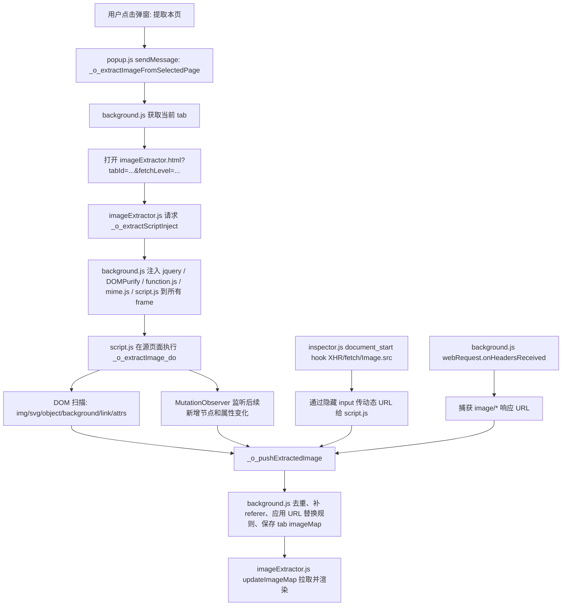

# ImageAssistant 本页图片提取链路

记录对象：Google Chrome 扩展 `dbjbempljhcmhlfpfacalomonjpalpko`

本机版本：`1.70.7`

原始扩展目录：

```text
/Users/zqy/Library/Application Support/Google/Chrome/Default/Extensions/dbjbempljhcmhlfpfacalomonjpalpko/1.70.7_0
```

本目录下 `source/` 保存了本次分析用到的相关原始代码副本。

## 关键文件

| 文件 | 作用 |
| --- | --- |
| `source/manifest.json` | 权限、后台 service worker、content script 声明 |
| `source/popup.html` | 弹窗入口 |
| `source/scripts/popup.js` | 用户点击“提取本页”的入口逻辑 |
| `source/scripts/background.js` | 后台调度、打开结果页、注入脚本、监听图片响应、保存图片 map |
| `source/imageExtractor.html` | 图片结果页 |
| `source/scripts/imageExtractor.js` | 结果页逻辑，请求后台注入源页脚本，拉取图片 map 并渲染 |
| `source/scripts/script.js` | 注入到源页面的主动提取脚本，负责 DOM 扫描和 MutationObserver |
| `source/scripts/inspector.js` | `document_start` 注入，hook XHR/fetch/Image，嗅探动态图片 URL |
| `source/scripts/function.js` | 通用工具：URL 处理、后台 ajax、滚动、图片加载检测 |
| `source/scripts/mime.js` | 图片类型和后缀映射 |

## Manifest 入口

`manifest.json` 的关键配置：

```json
{
  "action": {
    "default_popup": "popup.html"
  },
  "background": {
    "service_worker": "scripts/background.js"
  },
  "content_scripts": [
    {
      "all_frames": true,
      "js": ["scripts/inspector.js"],
      "matches": ["<all_urls>"],
      "run_at": "document_start"
    }
  ],
  "permissions": [
    "tabs",
    "scripting",
    "webNavigation",
    "webRequest",
    "declarativeNetRequest",
    "storage",
    "downloads",
    "contextMenus"
  ],
  "host_permissions": ["<all_urls>"]
}
```

含义：

- `popup.html` 是按钮弹窗。
- `background.js` 是调度中心。
- `inspector.js` 在所有页面和所有 frame 的 `document_start` 注入。
- `webRequest` 用于捕获实际图片响应。
- `scripting` 用于后续把主动提取脚本注入目标页面。

## 总流程



## 1. 弹窗触发

代码位置：`source/scripts/popup.js`

弹窗创建三个提取按钮：

- `data-level=0`：提取本页图片。
- `data-level=1`：预取链接。
- `data-level=2`：分析预取。

点击 `.extBtn` 后发送消息：

```js
chrome.runtime.sendMessage({
  type: "_o_extractImageFromSelectedPage",
  level: _o_fetchLevel
});
```

## 2. 后台打开结果页

代码位置：`source/scripts/background.js`

消息处理：

```js
case "_o_extractImageFromSelectedPage":
  await _o_extractImageFromSelectedPage(message.level);
```

调用链：

```text
_o_extractImageFromSelectedPage(level)
  -> chrome.tabs.query({ active: true, currentWindow: true })
  -> _o_extractImageFromTab(tab.id, level)
  -> _o_tiQuTupianaHaha(tabId, level, true)
  -> chrome.tabs.create({
       index: tab.index + 1,
       url: "imageExtractor.html?tabId=" + tab.id + "&fetchLevel=" + level,
       active: true
     })
```

后台不会直接显示图片，而是先打开 `imageExtractor.html` 作为结果页。

## 3. 结果页请求注入源页面脚本

代码位置：`source/scripts/imageExtractor.js`

结果页读取 query：

```text
tabId      = 被提取的源页面 tab
fetchLevel = 提取级别
```

之后调用 `_w_spleen(tabId, extractorHash, fetchLevel)`：

```text
_w_spleen
  -> chrome.runtime.sendMessage({ type: "_o_extractScriptInject", ... })
  -> 每 4 秒探测源页面是否还存在 _w_sewer
  -> 如果探测失败，重新请求注入
```

`_w_sewer` 是源页面 `script.js` 暴露的存活探针，返回当前 `window.extractorHash`。

## 4. 后台注入脚本

代码位置：`source/scripts/background.js`

注入函数：

```text
_o_extractScriptInject(extractorHash, fetchLevel)
  -> _o_getTabIdWithExtractorHash(extractorHash)
  -> _o_zhuruJSYongHash(tabId, fetchLevel, extractorHash + randomFinger)
```

`_o_zhuruJSYongHash` 注入到所有 frame：

```js
[
  "libs/jquery/3.4.1/jquery-3.4.1.min.js",
  "libs/DOMPurify/2.0.8/purify.min.js",
  "scripts/function.js",
  "scripts/mime.js",
  "scripts/script.js"
]
```

注入完成后向所有 frame 发送：

```js
{
  type: "_o_extractImage",
  _o_fetchLevel: fetchLevel,
  _o_extHash: extHash
}
```

## 5. 源页面主动 DOM 扫描

代码位置：`source/scripts/script.js`

入口：

```text
_o_extractImage(message._o_fetchLevel, message._o_extHash)
  -> _o_extractImage_do(fetchLevel, extHash)
```

`_o_extractImage_do` 做一次完整扫描：

| 来源 | 处理方式 | source 标记 |
| --- | --- | --- |
| `document.querySelectorAll("svg")` | `outerHTML` 转 `data:image/svg+xml` | `_w_brink` |
| `object[type='image/svg+xml'][data^='data:image/svg+xml']` | 读取 `object.data` | `_w_log` |
| `document.images` | 读取 `img.src`，附带 `title/alt/referer` | `_w_pelt` |
| 所有元素 `$("*")` | 读取 CSS `background-image: url(...)` | `_w_brute` |
| `document.links` | `href` 后缀是图片则提取 | `_w_sluice` |
| 链接 query 参数 | query 参数值是图片 URL 则提取 | `_w_revue` |
| 任意元素属性 | 非 `href/src` 属性中匹配图片 URL，创建 `Image` 试加载，成功才推送 | `_w_planet` |

额外行为：

- `_o_continousUpdatePageInfo()` 每 2 秒把页面 title/url 传回后台。
- `_o_addPageObserver()` 安装 `MutationObserver`。
- `try { $("*").trigger("mouseover") }` 用于触发懒加载。
- 根据 `fetchLevel` 可开启预取：
  - `fetchLevel & 1`：`prefetchForImage`
  - `fetchLevel & 2`：`prefetchForDomImage`

## 6. DOM 后续变化监听

代码位置：`source/scripts/script.js`

`_o_addPageObserver()` 做三类监听：

1. `$("img").on("load", handler)`
   - 图片加载完成后把 `img.src` 推送。

2. `MutationObserver` 监听 `attributes`
   - 如果变化节点在 `svg` 内，把最新 SVG 转成 `data:image/svg+xml`。
   - 如果是 SVG object 的 `data` 变化，读取 `object.data`。

3. `MutationObserver` 监听 `childList/subtree`
   - 新增节点中的 `svg`
   - 新增节点中的 `object[type='image/svg+xml']`
   - 新增节点中的 `a`
   - 新增节点中的 `img`
   - 新增节点及子节点的 CSS `background-image`
   - 新增节点属性中的图片 URL

这使插件能抓到 SPA、懒加载、滚动加载后的图片。

## 7. 动态请求嗅探

代码位置：`source/scripts/inspector.js`

`inspector.js` 有两阶段：

1. 作为 Chrome content script 注入隔离世界。
2. 再创建 `<script src="chrome-extension://.../scripts/inspector.js">` 注入页面主世界，才能 hook 页面自己的 `fetch/XHR/Image`。

它 hook 三个入口：

```text
XMLHttpRequest.prototype.send
window.fetch
window.Image 的 src setter
```

处理规则：

- 如果响应 `Content-Type` 是 `text/*`、`application/json`、`application/xml`、`application/xhtml+xml`、`application/ld+json` 等，就读取文本并用图片 URL 正则扫描。
- 如果响应 `Content-Type` 是 `image/*`，直接记录 `response.url`。
- 如果页面代码 `new Image().src = ...`，拦截 setter 并记录 URL。

动态嗅探到的 URL 暂存在 `_o_content_src_list`，然后通过隐藏 input 与 `script.js` 通信：

```text
input id = _o_dbjbempljhcmhlfpfacalomonjpalpko
```

`script.js` 看到 input 里有 JSON URL 列表后，会创建 `Image` 试加载，成功后走 `_o_pushImages`。

## 8. 网络层图片响应监听

代码位置：`source/scripts/background.js`

后台注册：

```text
chrome.webRequest.onHeadersReceived
```

监听范围：

```text
urls: ["<all_urls>"]
extraInfoSpec: ["responseHeaders", "extraHeaders"]
```

判断条件：

```text
details.type == "image" 且无 content-type
或 content-type startsWith("image/")
且 content-length 为空或大于 0
```

命中后生成图片项：

```js
{
  source: "_w_fervor",
  title: "",
  alt: "",
  serial: backgroundSerial++,
  referer: currentTabPageURL
}
```

然后投递：

```js
enqueueMessageAndHandle({
  type: "_o_pushExtractedImage",
  extractorHash,
  images
});
```

这层能抓到 DOM 没出现但浏览器实际请求过的图片。

## 9. 图片汇总、去重、URL 替换

代码位置：`source/scripts/background.js`

所有来源最终进入：

```text
_o_pushImages(...) in script.js
  -> chrome.runtime.sendMessage({ type: "_o_pushExtractedImage", images, extractorHash })
  -> background.js enqueueMessageAndHandle
  -> processQueue
  -> _o_tuiTiQuDeTupianNa
  -> _o_pushExtractedImage(imageMap, tabId)
```

`background.js::_o_pushExtractedImage` 做：

- URL 格式化，移除 hash。
- 排除扩展自身统计图和服务站点图片。
- 按 URL 去重。
- 保存 `title`、`alt`、`serial`、`referer`。
- 比较 `source` 优先级，必要时更新已有条目。
- 从 referer 生成域名规则，用 `declarativeNetRequest` 设置后续下载请求的 `Referer/Origin`。
- 应用 `defaultRegexpUrlRule.properties` 和远程规则，生成更接近原图的替换 URL。
- 向结果页发送：

```js
{ type: "_o_updateTupian", extractorHash }
{ type: "_o_updateTupianItem", extractorHash, ItemIdxMap }
```

## 10. 结果页渲染

代码位置：`source/scripts/imageExtractor.js`

结果页收到 `_o_updateTupian` 后：

```text
updateImageMap(true)
  -> chrome.runtime.sendMessage({ type: "_o_getImageMapByExtractorHash" })
  -> 拉取后台保存的 _w_imageMap 和 _w_tycoon 顺序数组
  -> _o_showImages(...)
```

每张图用 `new Image()` 加载。加载成功后读取：

- `naturalWidth`
- `naturalHeight`
- MIME/后缀
- 文件名
- referer

然后生成 `<a class="imageItem">`，后续支持筛选、预览、下载、去重。

## 结论

ImageAssistant 提取“本页图片”不是单靠 DOM 解析，而是四路合并：

1. 主动 DOM 扫描：`img/svg/object/background/link/attribute`
2. DOM 后续监听：`img load` 和 `MutationObserver`
3. 页面主世界嗅探：hook `XHR/fetch/Image.src`
4. 浏览器网络层兜底：`webRequest.onHeadersReceived` 捕获 `image/*`

所有图片最后统一进入后台 `tabIdMapper._w_imageMap`，由 URL 去重，保留顺序数组 `_w_tycoon`，再由 `imageExtractor.html` 拉取并展示。

